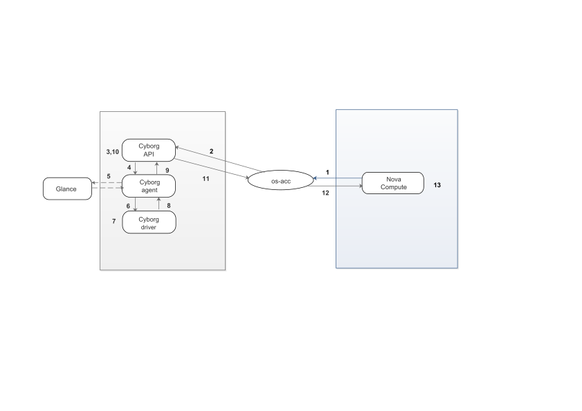

======
os-acc
======

`os-acc` is a library for attaching and detaching accelerators in OpenStack.
It provides:

- Virtual Accelerator Nexus(VAN) object, a handle object that represents a
  means by which an accelerator can be attached to a VM, container or process.
  It may be based on PCI functions (PCI VF with SR-IOV), mediated
  devices, Power architecture DRC Index (or location code or the like).

- Base os-acc plugin class that supplies a
  plug: ``aquire_accelerators_for_instance()`` and
  unplug: ``release_accelerators_for_instance`` interface.

During the process of instance creation and scheduling with accelerators,
`os-acc` will be invoked by nova-compute(n-cpu) on the node after
nova-scheduler successfully chooses a target compute node and a specific
device RP. The following diagram shows how os-acc interacts with cyborg, nova
and implements accelerators' attach and detach.

1.  'Nova Compute' -> 'os-acc' 'aquire_accelerators_for_instance(..) API'
2.  'os-acc' -> 'Cyborg API' 'POST /vans/instance/{uuid}'
3.  'Cyborg API' -> 'Cyborg API' 'Check RBAC; Query Glance for VM image properties; Persist VANs'
4.  'Cyborg API' -> 'Cyborg Agent' 'acquire_VANs_for_instance()'
5.  'Cyborg Agent' -> 'Cyborg Agent' 'Fetch Glance bitstreams if needed'
6.  'Cyborg Agent' -> 'Cyborg Driver' 'acquire_VAN()'
7.  'Cyborg Driver' -> 'Cyborg Driver' 'Configure device;    Acquire accelerator'
8.  'Cyborg Agent' <- 'Cyborg Driver' 'VAN_PCI in ACQUIRED state'
9.  'Cyborg API' <- 'Cyborg Agent' 'VAN_PCI []'
10. 'Cyborg API' -> 'Cyborg API' 'Persist VANs for instance'
11. 'os-acc' <- 'Cyborg API' 'VAN_PCI []'
12. 'Nova Compute' <- 'os-acc' 'VAN_PCI []'
13. 'Nova Compute' -> 'Nova Compute' 'Spawn VM'

Installation Guide
------------------

.. toctree::
   :maxdepth: 2

   install/index

Usage Guide
-----------

.. toctree::
   :maxdepth: 2

   user/usage
